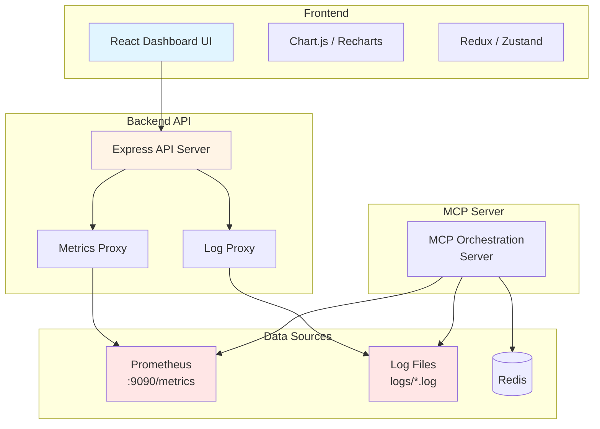

# 可視化ダッシュボード 技術仕様書

## 1. システム概要

### 1.1 アーキテクチャ



### 1.2 技術スタック選定理由

| 技術 | 選定理由 | 代替案 |
|------|---------|--------|
| **React** | コンポーネントベースで保守性が高い、豊富なダッシュボードライブラリ | Vue.js, Angular |
| **TypeScript** | 型安全性、IDE支援、保守性向上 | JavaScript |
| **Vite** | 高速な開発サーバー、最適化されたビルド | Create React App, Next.js |
| **Recharts** | React専用、カスタマイズ性が高い、軽量 | Chart.js, D3.js, Apache ECharts |
| **Zustand** | シンプル、軽量、学習コストが低い | Redux, MobX |
| **TanStack Query** | データフェッチング、キャッシング、自動再取得 | SWR, Apollo Client |
| **Tailwind CSS** | ユーティリティファースト、高速な開発 | Material-UI, Ant Design |
| **Express** | シンプル、軽量、既存のMCPサーバーと統一感 | Fastify, Koa |

## 2. システム構成

### 2.1 ディレクトリ構造

```
mcp-orchestration/
├── mcp-server/              # 既存のMCPサーバー
│   ├── src/
│   │   ├── index.ts
│   │   ├── logger.ts
│   │   └── metrics.ts
│   └── logs/
│       ├── combined.log
│       └── error.log
│
├── dashboard/               # 新規: ダッシュボードアプリケーション
│   ├── frontend/           # Reactフロントエンド
│   │   ├── src/
│   │   │   ├── components/
│   │   │   │   ├── layout/
│   │   │   │   │   ├── Header.tsx
│   │   │   │   │   ├── Sidebar.tsx
│   │   │   │   │   └── Layout.tsx
│   │   │   │   ├── metrics/
│   │   │   │   │   ├── TaskMetrics.tsx
│   │   │   │   │   ├── AgentMetrics.tsx
│   │   │   │   │   └── SystemMetrics.tsx
│   │   │   │   ├── logs/
│   │   │   │   │   ├── LogList.tsx
│   │   │   │   │   ├── LogDetail.tsx
│   │   │   │   │   └── LogFilter.tsx
│   │   │   │   ├── trace/
│   │   │   │   │   ├── TraceView.tsx
│   │   │   │   │   └── TraceTimeline.tsx
│   │   │   │   └── common/
│   │   │   │       ├── Card.tsx
│   │   │   │       ├── Chart.tsx
│   │   │   │       └── LoadingSpinner.tsx
│   │   │   ├── pages/
│   │   │   │   ├── Dashboard.tsx
│   │   │   │   ├── Metrics.tsx
│   │   │   │   ├── Logs.tsx
│   │   │   │   └── Traces.tsx
│   │   │   ├── hooks/
│   │   │   │   ├── useMetrics.ts
│   │   │   │   ├── useLogs.ts
│   │   │   │   └── useWebSocket.ts
│   │   │   ├── store/
│   │   │   │   └── dashboardStore.ts
│   │   │   ├── api/
│   │   │   │   └── client.ts
│   │   │   ├── types/
│   │   │   │   └── index.ts
│   │   │   ├── utils/
│   │   │   │   └── formatters.ts
│   │   │   ├── App.tsx
│   │   │   └── main.tsx
│   │   ├── public/
│   │   ├── package.json
│   │   ├── tsconfig.json
│   │   └── vite.config.ts
│   │
│   └── backend/            # Express APIサーバー
│       ├── src/
│       │   ├── routes/
│       │   │   ├── metrics.ts
│       │   │   ├── logs.ts
│       │   │   └── health.ts
│       │   ├── services/
│       │   │   ├── prometheusService.ts
│       │   │   └── logService.ts
│       │   ├── middleware/
│       │   │   ├── auth.ts
│       │   │   ├── cors.ts
│       │   │   └── errorHandler.ts
│       │   ├── utils/
│       │   │   ├── prometheusParser.ts
│       │   │   └── logParser.ts
│       │   ├── types/
│       │   │   └── index.ts
│       │   └── index.ts
│       ├── package.json
│       └── tsconfig.json
│
└── docker-compose.yml       # 統合Docker設定
```

### 2.2 ポート構成

| サービス | ポート | 用途 |
|---------|--------|------|
| MCP Server | stdio | MCPプロトコル通信 |
| Prometheus Metrics | 9090 | メトリクスエンドポイント |
| Dashboard Backend API | 3001 | REST API |
| Dashboard Frontend | 3000 | Webダッシュボード |
| Redis | 6379 | タスクキュー |

## 3. API仕様

### 3.1 REST API エンドポイント

#### 3.1.1 メトリクスAPI

**GET /api/metrics**
- **説明**: Prometheusメトリクスを取得・パース
- **クエリパラメータ**:
  - `metric`: メトリクス名（オプション、フィルタリング用）
- **レスポンス**:
```json
{
  "timestamp": "2025-11-21T06:30:00Z",
  "metrics": {
    "mcp_task_created_total": 1250,
    "mcp_task_completed_total": 1180,
    "mcp_task_failed_total": 70,
    "mcp_active_agents": 4,
    "mcp_task_duration_seconds": {
      "p50": 2.3,
      "p95": 8.7,
      "p99": 15.2,
      "mean": 3.1
    }
  }
}
```

**GET /api/metrics/timeseries**
- **説明**: 時系列メトリクスデータを取得
- **クエリパラメータ**:
  - `metric`: メトリクス名（必須）
  - `start`: 開始時刻（ISO 8601、デフォルト: 1時間前）
  - `end`: 終了時刻（ISO 8601、デフォルト: 現在）
  - `step`: サンプリング間隔（秒、デフォルト: 15）
- **レスポンス**:
```json
{
  "metric": "mcp_task_created_total",
  "data": [
    { "timestamp": "2025-11-21T06:00:00Z", "value": 1200 },
    { "timestamp": "2025-11-21T06:15:00Z", "value": 1225 },
    { "timestamp": "2025-11-21T06:30:00Z", "value": 1250 }
  ]
}
```

#### 3.1.2 ログAPI

**GET /api/logs**
- **説明**: ログエントリを取得
- **クエリパラメータ**:
  - `level`: ログレベル (info, warn, error、オプション)
  - `trace_id`: トレースID（オプション）
  - `task_id`: タスクID（オプション）
  - `search`: フリーテキスト検索（オプション）
  - `start`: 開始時刻（ISO 8601、オプション）
  - `end`: 終了時刻（ISO 8601、オプション）
  - `limit`: 取得件数（デフォルト: 100）
  - `offset`: オフセット（ページネーション用、デフォルト: 0）
- **レスポンス**:
```json
{
  "total": 5432,
  "limit": 100,
  "offset": 0,
  "logs": [
    {
      "timestamp": "2025-11-21T06:30:15.234Z",
      "level": "info",
      "message": "Task created",
      "service": "mcp-orchestration-server",
      "task_id": "task-1732172415234-abc123",
      "trace_id": "550e8400-e29b-41d4-a716-446655440000",
      "agent_type": "implementation"
    }
  ]
}
```

**GET /api/logs/:id**
- **説明**: 特定のログエントリの詳細を取得
- **レスポンス**: 単一のログオブジェクト（完全なJSON構造）

#### 3.1.3 トレースAPI

**GET /api/traces/:trace_id**
- **説明**: 特定のトレースIDに関連するすべてのイベントを取得
- **レスポンス**:
```json
{
  "trace_id": "550e8400-e29b-41d4-a716-446655440000",
  "task_id": "task-1732172415234-abc123",
  "events": [
    {
      "timestamp": "2025-11-21T06:30:15.234Z",
      "event": "task_created",
      "data": { "agent_type": "implementation", "description": "..." }
    },
    {
      "timestamp": "2025-11-21T06:30:16.123Z",
      "event": "task_assigned",
      "data": { "agent_id": "agent-xyz" }
    },
    {
      "timestamp": "2025-11-21T06:30:25.456Z",
      "event": "task_completed",
      "data": { "duration": 9.222 }
    }
  ],
  "duration": 10.222,
  "status": "completed"
}
```

#### 3.1.4 ヘルスチェックAPI

**GET /api/health**
- **説明**: システム全体のヘルスステータスを取得
- **レスポンス**:
```json
{
  "status": "healthy",
  "timestamp": "2025-11-21T06:30:00Z",
  "services": {
    "mcp_server": { "status": "up", "latency_ms": 5 },
    "prometheus": { "status": "up", "latency_ms": 12 },
    "redis": { "status": "up", "latency_ms": 3 },
    "log_files": { "status": "up", "readable": true }
  },
  "metrics_summary": {
    "active_agents": 4,
    "pending_tasks": 12,
    "error_rate_1h": 5.6
  }
}
```

### 3.2 WebSocket API

**WS /api/ws/logs**
- **説明**: リアルタイムログストリーミング
- **送信メッセージ**:
```json
{
  "action": "subscribe",
  "filters": {
    "level": ["error", "warn"],
    "trace_id": "optional-trace-id"
  }
}
```
- **受信メッセージ**: ログエントリ（JSON形式）

**WS /api/ws/metrics**
- **説明**: リアルタイムメトリクスストリーミング
- **更新間隔**: 5秒

## 4. フロントエンド設計

### 4.1 ページ構成

#### 4.1.1 ホームダッシュボード (`/`)

**レイアウト**:
```
┌────────────────────────────────────────────────┐
│ Header (MCP Orchestration Dashboard)           │
├──────┬─────────────────────────────────────────┤
│      │ System Health Status                    │
│ Side │ ┌─────┬─────┬─────┬─────┐              │
│ bar  │ │ OK  │ OK  │WARN │ OK  │              │
│      │ └─────┴─────┴─────┴─────┘              │
│ Nav  │                                         │
│      │ Key Metrics                             │
│ -    │ ┌────────────┬────────────┐            │
│ Home │ │ Tasks      │ Agents     │            │
│ -    │ │ Created:   │ Active: 4  │            │
│ Metr │ │ 1250       │ Idle: 2    │            │
│ ics  │ │ Success:   │ Offline: 0 │            │
│ -    │ │ 94.4%      │            │            │
│ Logs │ └────────────┴────────────┘            │
│ -    │                                         │
│ Trac │ Task Processing Rate (Last 1h)         │
│ es   │ ┌──────────────────────────────────┐   │
│      │ │  ╱╲    ╱╲                        │   │
│      │ │ ╱  ╲  ╱  ╲                       │   │
│      │ │      ╲╱                          │   │
│      │ └──────────────────────────────────┘   │
│      │                                         │
│      │ Recent Errors                           │
│      │ ┌──────────────────────────────────┐   │
│      │ │ [ERROR] Task timeout (15:28)     │   │
│      │ │ [WARN] High latency (15:22)      │   │
│      │ └──────────────────────────────────┘   │
└──────┴─────────────────────────────────────────┘
```

**主要コンポーネント**:
- `SystemHealthBadge`: ヘルスステータス表示
- `MetricCard`: KPI カード
- `TaskRateChart`: タスク処理レートグラフ
- `RecentErrorsList`: 最近のエラー一覧

#### 4.1.2 メトリクスページ (`/metrics`)

**レイアウト**:
- 時間範囲セレクター（1h, 6h, 24h, 7d, カスタム）
- タスクメトリクスセクション
  - 作成/完了/失敗数の時系列グラフ
  - 成功率の推移
  - 処理時間のヒストグラム
- エージェントメトリクスセクション
  - アクティブエージェント数
  - エージェントタイプ別の内訳（円グラフ）
- システムメトリクスセクション
  - CPU/メモリ使用率
  - イベントループ遅延

#### 4.1.3 ログページ (`/logs`)

**レイアウト**:
- フィルターパネル（左/上部）
  - レベル選択（チェックボックス）
  - 時間範囲
  - フリーテキスト検索
  - Trace ID / Task ID 検索
- ログテーブル
  - カラム: Timestamp, Level, Message, Task ID, Trace ID, Actions
  - ページネーションまたは無限スクロール
- ログ詳細モーダル

#### 4.1.4 トレースページ (`/traces`)

**レイアウト**:
- Trace ID 検索バー
- タイムラインビュー
  - ガントチャート形式
  - 各イベントの所要時間
  - 依存関係の矢印表示
- イベント詳細パネル

### 4.2 UI/UXガイドライン

#### 4.2.1 カラーパレット

```css
/* Primary Colors */
--primary-blue: #0066CC;
--primary-dark: #004D99;
--primary-light: #3399FF;

/* Status Colors */
--success: #10B981;    /* Green */
--warning: #F59E0B;    /* Amber */
--error: #EF4444;      /* Red */
--info: #3B82F6;       /* Blue */

/* Neutral Colors */
--gray-50: #F9FAFB;
--gray-100: #F3F4F6;
--gray-200: #E5E7EB;
--gray-300: #D1D5DB;
--gray-700: #374151;
--gray-900: #111827;

/* Background */
--bg-primary: #FFFFFF;
--bg-secondary: #F9FAFB;
--bg-dark: #1F2937;
```

#### 4.2.2 レスポンシブブレークポイント

```css
/* Tailwind デフォルトを使用 */
sm: 640px   /* タブレット縦 */
md: 768px   /* タブレット横 */
lg: 1024px  /* デスクトップ */
xl: 1280px  /* 大画面デスクトップ */
2xl: 1536px /* 超大画面 */
```

#### 4.2.3 アクセシビリティ

- ARIA ラベルの適切な使用
- キーボードナビゲーション対応
- コントラスト比 4.5:1 以上
- スクリーンリーダー対応

## 5. データフロー

### 5.1 メトリクスデータフロー

```
1. MCP Server → Prometheus形式でメトリクスを公開 (:9090/metrics)
2. Dashboard Backend → 定期的にPrometheusエンドポイントをポーリング
3. Dashboard Backend → メトリクスをパースして構造化データに変換
4. Dashboard Backend → REST API / WebSocketで Frontend に送信
5. Frontend → TanStack Query でキャッシュ・自動更新
6. Frontend → Recharts でグラフ描画
```

### 5.2 ログデータフロー

```
1. MCP Server → Winston でログファイルに書き込み (logs/*.log)
2. Dashboard Backend → ログファイルを監視（fs.watch / chokidar）
3. Dashboard Backend → 新規ログをパース・構造化
4. Dashboard Backend → REST API で過去ログ提供 / WebSocket でリアルタイム配信
5. Frontend → ログ一覧表示・フィルタリング
```

## 6. 実装詳細

### 6.1 Prometheusメトリクスパーサー

```typescript
// backend/src/utils/prometheusParser.ts
import { parse } from 'prom-client';

interface Metric {
  name: string;
  type: 'counter' | 'gauge' | 'histogram' | 'summary';
  help: string;
  values: MetricValue[];
}

interface MetricValue {
  labels: Record<string, string>;
  value: number;
  timestamp?: number;
}

export class PrometheusParser {
  async parseMetrics(metricsText: string): Promise<Metric[]> {
    // prom-client のパーサーを使用
    const registry = new Registry();
    // ... パース処理
    return metrics;
  }

  calculatePercentiles(
    histogramData: HistogramValue[],
    percentiles: number[]
  ): Record<string, number> {
    // ヒストグラムからパーセンタイル計算
  }
}
```

### 6.2 ログパーサー

```typescript
// backend/src/utils/logParser.ts
import fs from 'fs';
import readline from 'readline';
import { Watch } from 'chokidar';

export class LogParser {
  private watcher: Watch;

  async readLogs(
    filePath: string,
    filters: LogFilters,
    limit: number,
    offset: number
  ): Promise<LogEntry[]> {
    const fileStream = fs.createReadStream(filePath);
    const rl = readline.createInterface({
      input: fileStream,
      crlfDelay: Infinity,
    });

    const logs: LogEntry[] = [];
    let lineNumber = 0;

    for await (const line of rl) {
      try {
        const log = JSON.parse(line);
        if (this.matchesFilter(log, filters)) {
          if (lineNumber >= offset && logs.length < limit) {
            logs.push(log);
          }
          lineNumber++;
        }
      } catch (error) {
        // Invalid JSON行をスキップ
      }
    }

    return logs;
  }

  watchLogs(filePath: string, callback: (log: LogEntry) => void): void {
    this.watcher = fs.watch(filePath, (eventType) => {
      if (eventType === 'change') {
        // 新規行を読み取り、コールバックを呼び出す
      }
    });
  }

  private matchesFilter(log: LogEntry, filters: LogFilters): boolean {
    // フィルタリングロジック
  }
}
```

### 6.3 Frontend Custom Hooks

```typescript
// frontend/src/hooks/useMetrics.ts
import { useQuery } from '@tanstack/react-query';
import { api } from '../api/client';

export function useMetrics(
  metric: string,
  timeRange: TimeRange = '1h',
  refreshInterval: number = 30000
) {
  return useQuery({
    queryKey: ['metrics', metric, timeRange],
    queryFn: () => api.getTimeSeriesMetrics(metric, timeRange),
    refetchInterval: refreshInterval,
    staleTime: 15000,
  });
}

// frontend/src/hooks/useLogs.ts
export function useLogs(filters: LogFilters) {
  return useQuery({
    queryKey: ['logs', filters],
    queryFn: () => api.getLogs(filters),
    keepPreviousData: true,
  });
}

// frontend/src/hooks/useWebSocket.ts
export function useWebSocketLogs(callback: (log: LogEntry) => void) {
  useEffect(() => {
    const ws = new WebSocket('ws://localhost:3001/api/ws/logs');
    
    ws.onmessage = (event) => {
      const log = JSON.parse(event.data);
      callback(log);
    };

    return () => ws.close();
  }, [callback]);
}
```

## 7. セキュリティ

### 7.1 認証

```typescript
// backend/src/middleware/auth.ts
import jwt from 'jsonwebtoken';

export const authMiddleware = (req, res, next) => {
  const token = req.headers.authorization?.split(' ')[1];
  
  if (!token) {
    return res.status(401).json({ error: 'Unauthorized' });
  }

  try {
    const decoded = jwt.verify(token, process.env.JWT_SECRET);
    req.user = decoded;
    next();
  } catch (error) {
    return res.status(401).json({ error: 'Invalid token' });
  }
};
```

### 7.2 CORS設定

```typescript
// backend/src/middleware/cors.ts
import cors from 'cors';

export const corsOptions = {
  origin: process.env.FRONTEND_URL || 'http://localhost:3000',
  credentials: true,
  methods: ['GET', 'POST'],
};
```

## 8. デプロイメント

### 8.1 Docker構成

```yaml
# docker-compose.yml
version: '3.8'

services:
  redis:
    image: redis:7-alpine
    ports:
      - "6379:6379"

  mcp-server:
    build: ./mcp-server
    ports:
      - "9090:9090"
    depends_on:
      - redis
    environment:
      - REDIS_URL=redis://redis:6379

  dashboard-backend:
    build: ./dashboard/backend
    ports:
      - "3001:3001"
    depends_on:
      - mcp-server
    environment:
      - PROMETHEUS_URL=http://mcp-server:9090/metrics
      - LOG_PATH=../mcp-server/logs
    volumes:
      - ./mcp-server/logs:/app/logs:ro

  dashboard-frontend:
    build: ./dashboard/frontend
    ports:
      - "3000:3000"
    depends_on:
      - dashboard-backend
    environment:
      - VITE_API_URL=http://localhost:3001/api
```

### 8.2 環境変数

```bash
# dashboard/backend/.env
PORT=3001
PROMETHEUS_URL=http://localhost:9090/metrics
LOG_PATH=../../mcp-server/logs
JWT_SECRET=your-secret-key
CORS_ORIGIN=http://localhost:3000

# dashboard/frontend/.env
VITE_API_URL=http://localhost:3001/api
VITE_WS_URL=ws://localhost:3001/api/ws
```

## 9. テスト戦略

### 9.1 バックエンドテスト

```typescript
// backend/src/services/prometheusService.test.ts
describe('PrometheusService', () => {
  it('should parse Prometheus metrics correctly', async () => {
    const service = new PrometheusService();
    const metrics = await service.getMetrics();
    
    expect(metrics).toHaveProperty('mcp_task_created_total');
    expect(metrics.mcp_task_created_total).toBeGreaterThan(0);
  });
});
```

### 9.2 フロントエンドテスト

```typescript
// frontend/src/components/TaskMetrics.test.tsx
import { render, screen } from '@testing-library/react';
import { QueryClient, QueryClientProvider } from '@tanstack/react-query';
import TaskMetrics from './TaskMetrics';

describe('TaskMetrics', () => {
  it('should display task metrics', async () => {
    const queryClient = new QueryClient();
    
    render(
      <QueryClientProvider client={queryClient}>
        <TaskMetrics />
      </QueryClientProvider>
    );

    expect(await screen.findByText(/Tasks Created/i)).toBeInTheDocument();
  });
});
```

### 9.3 E2Eテスト

```typescript
// e2e/dashboard.spec.ts
import { test, expect } from '@playwright/test';

test('should display dashboard and metrics', async ({ page }) => {
  await page.goto('http://localhost:3000');
  
  // ホームダッシュボードが表示される
  await expect(page.locator('h1')).toContainText('Dashboard');
  
  // メトリクスカードが表示される
  await expect(page.locator('[data-testid="task-metrics"]')).toBeVisible();
  
  // ログページに移動
  await page.click('text=Logs');
  await expect(page.locator('[data-testid="log-list"]')).toBeVisible();
});
```

## 10. パフォーマンス最適化

### 10.1 フロントエンド最適化
- コード分割（React.lazy + Suspense）
- 仮想スクロール（react-window）
- メモ化（React.memo, useMemo, useCallback）
- Web Workers でのデータ処理

### 10.2 バックエンド最適化
- Redis キャッシング
- ログファイルのインデックス化
- ストリーミングレスポンス
- 圧縮（gzip）

### 10.3 ネットワーク最適化
- HTTP/2
- WebSocket の効率的な使用
- データ圧縮
- CDN の利用（本番環境）

## 11. 監視とロギング

ダッシュボード自体の監視:
- Backend API のヘルスチェック
- Frontend のエラートラッキング（Sentry等）
- パフォーマンスメトリクス（Web Vitals）

## 12. 今後の拡張

### フェーズ2
- カスタムダッシュボード作成機能
- アラート設定UI
- レポート生成・エクスポート機能
- ダークモード

### フェーズ3
- 複数環境の統合監視
- ユーザー権限管理
- API レート制限
- SSO統合

## 13. 付録

### 13.1 参考実装
- Grafana: https://grafana.com/
- Kibana: https://www.elastic.co/kibana
- Prometheus UI: https://prometheus.io/

### 13.2 関連ドキュメント
- [要件定義書](file:///c:/Users/zeroz/Orchestrations/reports/requirements_dashboard.md)
- [観測性実装計画](file:///c:/Users/zeroz/Orchestrations/reports/implementation_plan_observability.md)
